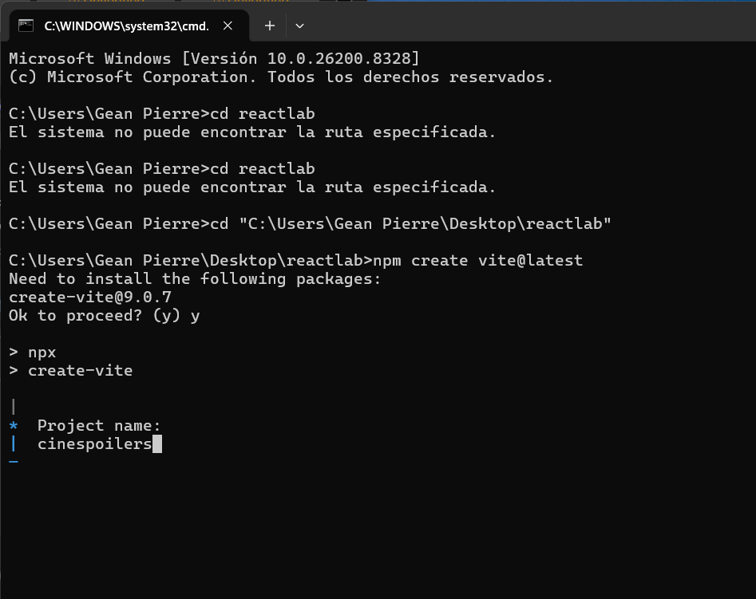
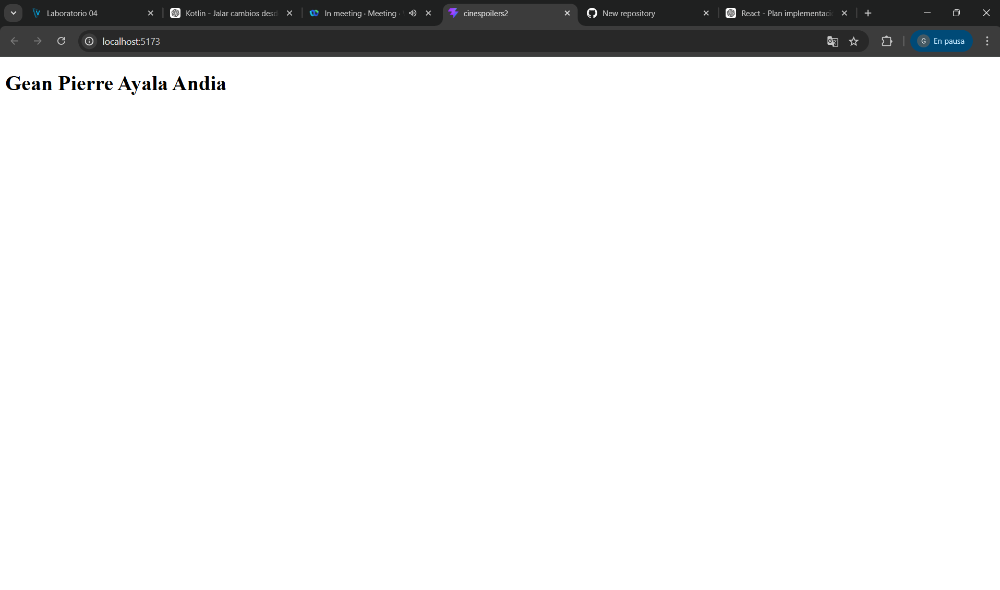
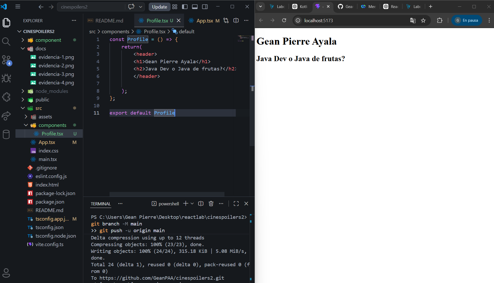

# 🎬 CineSpoilers2

Aplicación web desarrollada con React para explorar películas (prueba).

---

## 📸 Evidencias

### Captura 1

### Captura 2

### Captura 3

### Captura 4

### Captura 5

---

## 🛠️ Tecnologías

* React
* Vite
* TypeScript
* CSS
* HTML

---

## 👨‍💻 Autor

**Gean Pierre Ayala Andia**

